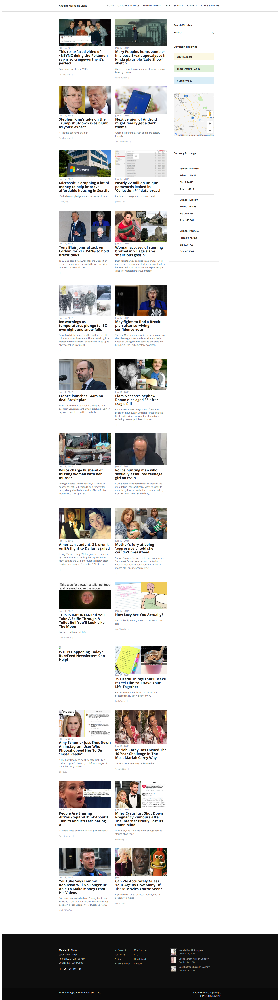

Mashable clone angular

Created with angular cli,
clone and run script

This app was created to get familiar with the ngrx/Redux like  pattern for state management.

It reads news feeds from https://newsapi.org/ and creates a mashable like clone.

to run :

[1] Clone,
[2] Run

  npm install
  
  npm start 

Sample page of application:

